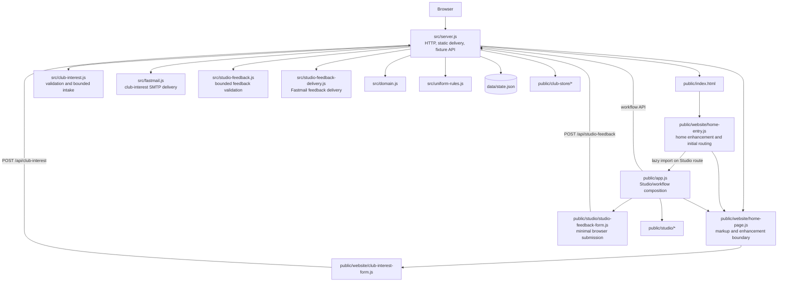

# Current-state architecture map

## 1. System boundary

Pivot is a small Node.js modular monolith serving four experiences. It uses one runtime dependency, Nodemailer, to keep authenticated Fastmail SMTP/TLS handling out of application code:

1. The public Pivot website.
2. The browser-local Pivot Design Studio trial with in-house tester feedback delivery.
3. An isolated fixture-backed workflow simulation.
4. Static Club Store landing, customer preview, administration preview and local review pages.

It is not the production platform. Production identity, durable storage, supplier templates, manufacturing integration, ordering and payments are not implemented.

## 2. Capability ownership

| Capability | Current repository coverage | Current owner |
|---|---|---|
| Main Website | Server-rendered initial markup, browser enhancement and an in-house club-interest endpoint with Fastmail SMTP delivery | `public/website/*`, `src/club-interest.js`, `src/fastmail.js`, composed by `src/server.js` |
| Design Studio | Browser-local four-surface trial with direct template selection, preview, history, checks and an in-house tester-feedback endpoint with Fastmail delivery | `public/studio/*`, `src/studio-feedback.js`, `src/studio-feedback-delivery.js`, composed by `public/app.js` and `src/server.js` |
| Workflow simulation | Fixture identities, design transitions and simulated administration | `public/app.js`, `src/domain.js`, `src/server.js`, `data/state.json` |
| Uniform rules | Adopted BBA basketball-jersey baseline and server profile | `docs/BBA Basketball Jersey Guidelines.md`, `src/uniform-rules.js`, with browser checks in `public/studio/studio-state.js` |
| Club Store | Static landing, separate non-transactional customer and administration previews, plus fixture-backed store projection API | `public/club-store/*`, `src/domain.js`, `src/server.js` |
| Temporary Website | Isolated temporary landing page | `public/temporary-landing.html`, `public/temporary-landing.css` |

Capabilities that are not implemented remain documented in `docs/Capability Map.md`; no empty code containers represent them.

## 3. Runtime dependency map

## 4. Browser route ownership

`public/website/home-entry.js` owns the lightweight homepage start. Only `#studio` loads the Studio stylesheet and imports `public/app.js`; the old public `#workflow-demo` and `#admin` entries are not exposed by the tester release. The Studio application then owns subsequent hash changes and can restore or enhance the homepage.

This hand-off avoids loading Studio code on the homepage and keeps fixture administration routes out of the tester entry. It is acceptable at the current scale because there are only two route owners and the transition is explicit. It is a watch point rather than a refactoring task. Reconsider it if routes multiply, listeners conflict, navigation loses state, or tests require knowledge of both routers.

## 5. State boundaries

### Public Studio

- Created from `public/studio/studio-config.js`.
- Changed through the commands in `public/studio/studio-state.js`.
- Persisted to browser `sessionStorage` through an injected storage-compatible adapter.
- Not sent to protected design-write endpoints.

### Workflow simulation

- Fixture clubs, users and designs live in `data/state.json`.
- Demo identity comes from the `x-demo-user` request header.
- Editor details also use browser `localStorage`.
- This remains explicitly non-production.

The public Studio and workflow simulation still use different design representations. This is the most important existing architecture distinction to preserve visibly until an approved change gives them one meaning.

## 6. Delivery and styling

- `src/server.js` serves static assets, injects initial homepage markup, applies security/cache headers and compression, exposes the fixture API, and composes the club-interest and Studio-feedback endpoints with injected delivery functions.
- `src/club-interest.js` owns bounded club-interest field validation. `src/fastmail.js` owns its exact Fastmail SMTP configuration and message translation behind one injected send function.
- `public/studio/studio-feedback-form.js` limits the browser payload and owns safe form-delivery errors. `src/studio-feedback.js` owns the accepted bounded feedback shape, while `src/studio-feedback-delivery.js` owns Fastmail message translation for the separately approved tester-feedback workflow.
- `public/website/home.css` owns the website shell and homepage styling and is reused by the Club Store landing page.
- `public/style.css` contains Studio/workflow presentation and is loaded only when a Studio route is selected.
- Capability-specific Club Store styling remains under `public/club-store/`; the customer preview stores only its light/dark display preference in browser `localStorage`, while administration colour/theme controls remain unsaved.

Shared website-shell CSS does not yet justify another directory or stylesheet. Extract it only if independent consumers or conflicting change patterns make `home.css` difficult to use safely.

## 7. Verification boundary

The Node test suite covers domain policy, HTTP behaviour, website rendering and enhancement, club-interest and Studio-feedback form behaviour, Studio state/preview and direct entry, Club Store pages and repository guardrails. Browser/device behaviour remains a documented manual-verification responsibility. Playwright and axe-core Playwright remain prohibited.
